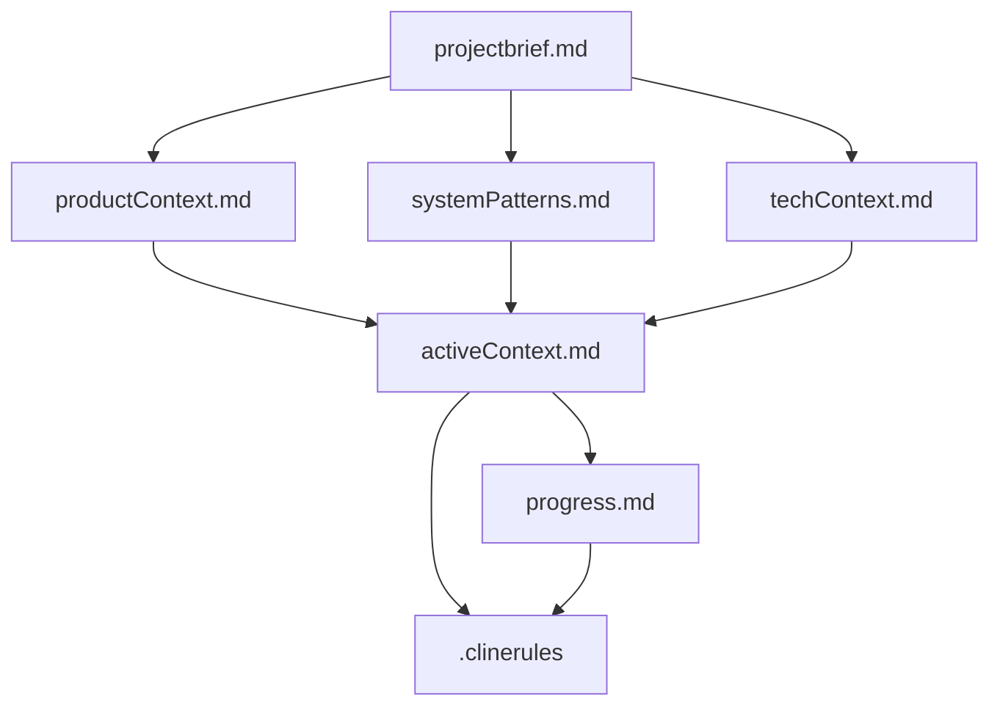

# TruckChecks Memory Bank

This memory bank contains comprehensive documentation for the TruckChecks inventory management system. It serves as the primary knowledge base for understanding the project's architecture, current state, and future development.

## Memory Bank Structure

### Core Documentation Files

#### 1. **projectbrief.md**
- **Purpose**: Foundation document defining project scope and requirements
- **Contains**: Project overview, business requirements, target users, technology stack
- **When to Read**: Start here for high-level understanding of the project

#### 2. **productContext.md**
- **Purpose**: Product vision and user experience goals
- **Contains**: Problem statement, solution overview, feature descriptions, success metrics
- **When to Read**: When planning new features or understanding user needs

#### 3. **systemPatterns.md**
- **Purpose**: Technical architecture and design patterns
- **Contains**: Database schema, code patterns, UI/UX patterns, security patterns
- **When to Read**: When implementing new features or refactoring code

#### 4. **techContext.md**
- **Purpose**: Technical implementation details and environment setup
- **Contains**: Technology stack, database config, security implementation, deployment
- **When to Read**: When setting up development environment or troubleshooting

#### 5. **activeContext.md**
- **Purpose**: Current work focus and recent changes
- **Contains**: Recent developments, current system state, next steps, technical decisions
- **When to Read**: At the start of every development session

#### 6. **progress.md**
- **Purpose**: Project status and roadmap
- **Contains**: Completed features, remaining work, known issues, future plans
- **When to Read**: When planning work or reporting project status

#### 7. **.clinerules**
- **Purpose**: Project intelligence and learned patterns
- **Contains**: Critical patterns, user preferences, known challenges, development workflow
- **When to Read**: Before making any code changes or when encountering issues

## How to Use This Memory Bank

### For New Development Sessions
1. **Start with activeContext.md** - Understand current state and recent changes
2. **Review .clinerules** - Apply learned patterns and avoid known pitfalls
3. **Check progress.md** - Understand what's completed and what's next
4. **Reference systemPatterns.md** - Follow established architectural patterns

### For New Features
1. **Review productContext.md** - Ensure feature aligns with user goals
2. **Check systemPatterns.md** - Follow established design patterns
3. **Update activeContext.md** - Document new work and decisions
4. **Update .clinerules** - Capture new patterns and learnings

### For Bug Fixes
1. **Check .clinerules** - Look for known issues and solutions
2. **Review systemPatterns.md** - Understand expected behavior
3. **Update activeContext.md** - Document fixes and changes

### For Project Handoffs
1. **Read projectbrief.md** - Understand project scope and goals
2. **Review all files sequentially** - Build comprehensive understanding
3. **Focus on activeContext.md** - Understand current state
4. **Study .clinerules** - Learn project-specific patterns

## Maintenance Guidelines

### When to Update Files

#### activeContext.md
- **Update**: After every significant development session
- **Include**: New features, bug fixes, technical decisions, next steps

#### progress.md
- **Update**: Weekly or after major milestones
- **Include**: Completed features, updated roadmap, status changes

#### .clinerules
- **Update**: When discovering new patterns or solving complex issues
- **Include**: New patterns, user preferences, solutions to challenges

#### Other Files
- **Update**: When fundamental changes occur to architecture or requirements
- **Include**: Structural changes, new technologies, requirement updates

### Documentation Standards

#### Writing Style
- **Clear and Concise**: Use simple, direct language
- **Technical Accuracy**: Ensure all code examples and patterns are correct
- **Actionable Information**: Focus on information that helps with development
- **Current State**: Keep information up-to-date and relevant

#### Code Examples
- **Complete Examples**: Show full context, not just snippets
- **Commented Code**: Explain complex or critical sections
- **Best Practices**: Demonstrate proper patterns and security
- **Working Code**: Ensure all examples actually work

## File Relationships

## Quick Reference

### Critical Patterns
- **Authentication**: Always check login status first
- **AJAX**: Handle AJAX requests before HTML output
- **Database**: Use prepared statements for all queries
- **Security**: Escape all user output with htmlspecialchars()

### User Preferences
- **Real-time Filtering**: Instant updates without page reloads
- **Two-step Selection**: Truck → Locker → Item workflow
- **Touch-Friendly**: Large buttons for mobile use
- **In-place Editing**: Edit without leaving current page

### Development Workflow
1. Read activeContext.md and .clinerules
2. Implement following established patterns
3. Test thoroughly (login, CRUD, filtering, mobile)
4. Update documentation with changes and learnings

## Contact & Support

This memory bank is designed to be self-contained and comprehensive. If you need additional information:

1. **Check all memory bank files** - Information may be in a different file
2. **Review code comments** - Additional context may be in the source code
3. **Check git history** - Recent changes may provide context
4. **Update memory bank** - Add missing information for future reference

Remember: The memory bank is only as good as it is maintained. Always update it with new learnings and changes to keep it valuable for future development.
